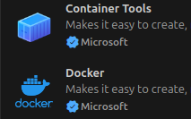
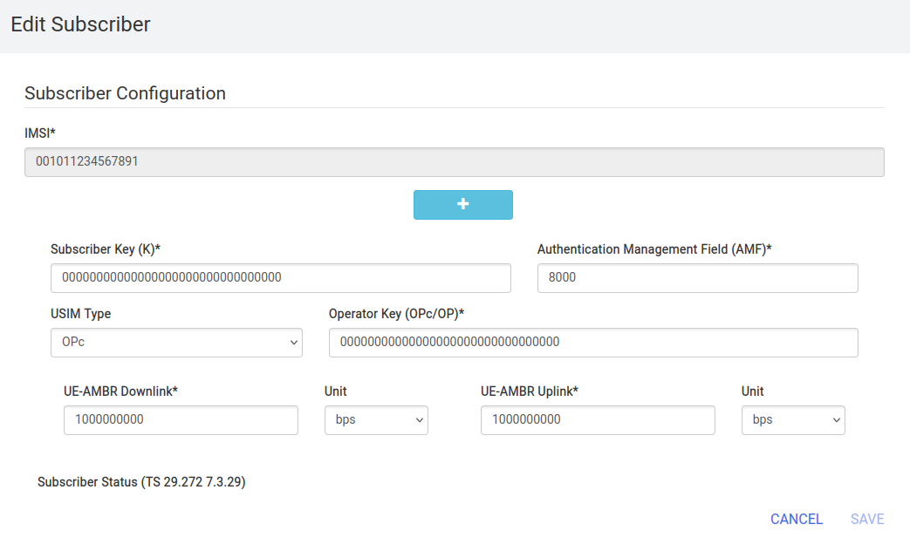

[](https://classroom.github.com/a/F_GIW8P0)
[](https://classroom.github.com/online_ide?assignment_repo_id=21965889&assignment_repo_type=AssignmentRepo)
# Mobile Computing Template Wintersemester 2025/26

The following steps will help you apply what is provided here.

## Installation

> [!NOTE]
> Recommended minimum resources:
> - CPU: 4 cores
> - Memory: 8 GB RAM
> - Disk space: 50 GB

#### Install Ubuntu 24.04 LTS  

Download and install [Ubuntu 24.04 Desktop](https://ubuntu.com/download/desktop)   
E.g., you can use a VM under Windows with the following tools, for example: VirtualBox, VMware Workstation or Hyper-V (built-in for Pro/Enterprise).
> [!CAUTION]
> WSL has known issues with SCTP, which is relevant to the project!

After installation update and upgrade packages:
```bash
sudo apt update 
sudo apt upgrade
```

#### Install further needed packages:
```bash
sudo apt install bzip2 git make gcc
```

#### Install MongoDB
```bash
wget -qO- https://www.mongodb.org/static/pgp/server-8.0.asc | sudo tee /etc/apt/trusted.gpg.d/server-8.0.asc
echo "deb [ arch=amd64,arm64 ] https://repo.mongodb.org/apt/ubuntu noble/mongodb-org/8.0 multiverse" | sudo tee /etc/apt/sources.list.d/mongodb-org-8.0.list
sudo apt-get update
sudo apt-get install -y mongodb-mongosh
```

#### Install Wireshark
```bash
sudo apt install wireshark
# allow also other users than super user
sudo adduser $USER wireshark
```

#### Install Docker and Docker Compose

The following is taken from the [Docker](https://docs.docker.com/engine/install/ubuntu/#install-using-the-repository) instructions
```bash
# Add Docker's official GPG key:
sudo apt update
sudo apt install ca-certificates curl
sudo install -m 0755 -d /etc/apt/keyrings
sudo curl -fsSL https://download.docker.com/linux/ubuntu/gpg -o /etc/apt/keyrings/docker.asc
sudo chmod a+r /etc/apt/keyrings/docker.asc
```
```bash
# Add the repository to Apt sources:
sudo tee /etc/apt/sources.list.d/docker.sources <<EOF
Types: deb
URIs: https://download.docker.com/linux/ubuntu
Suites: $(. /etc/os-release && echo "${UBUNTU_CODENAME:-$VERSION_CODENAME}")
Components: stable
Signed-By: /etc/apt/keyrings/docker.asc
EOF
```
```bash
# Update and install
sudo apt update
sudo apt install docker-ce docker-ce-cli containerd.io docker-buildx-plugin docker-compose-plugin
```
```bash
# Add permissions
sudo usermod -aG docker ${USER}
```
```bash
# Check Docker and Docker Compose version
docker version
docker compose version
```

You should also change the IP address and subnet of the Docker bridge via the ```/etc/docker/daemon.json``` file (create it if needed).  
The “bip” entry defines the docker0 subnet. Here is an example of the ```/etc/docker/daemon.json``` file:
```bash
{ "bip": "172.20.0.1/24" }
```

Next reboot your machine or computer!

#### Install 5G GTP-U Kernel Module for Packetrusher

```bash
git clone -b v0.9.14 https://github.com/free5gc/gtp5g.git
cd gtp5g
make
sudo make install
```

After installation, ensure the module is installed  
```bash
modinfo gtp5g
```

#### Install Visual Studio Code
```bash
sudo snap install --classic code 
```

Open Visual Studio Code and clone your GitHub project repository see [Tutorial](https://code.visualstudio.com/docs/sourcecontrol/intro-to-git#_clone-a-repository-locally)

Next install the following extension packages in Visual Studio Code  
 

#### Configure host IP
Configure the .env-file under ```/build-files/open5gs.env```
```bash
HOST_IP_ADDRESS=10.0.2.15
```
Instead of the IP address 10.0.2.15, enter the local IP address of your computer or virtual machine.

## Starting the first application

Enter the following comand inside the Visual Studio Code Terminal  
```bash
docker compose -f compose-files/basic/packetrusher/docker-compose.yaml --env-file=build-files/open5gs.env up -d
```

All necessary Docker containers should now be downloaded from the Internet and started using Docker Compose.  
After startup, a user profile should be created in the 5G core database.  
You can do this via the WebUI, for example.  

#### Register Subscriber Information

Connect to http://localhost:9999 and login with admin account.  
Username : admin  
Password : 1423  


Tip: You can change the password in Account Menu.


To add subscriber information, you can do WebUI operations in the following order:  
- Go to Subscriber Menu.
- Click + Button to add a new subscriber.
- Fill the IMSI, security context(K, OPc, AMF), and APN of the subscriber.
- Click SAVE Button  
 

The corresponding UE credentials can be found in the UE configuration file, e.g., in the currently used docker compose scenario under
[/configs/basic/packetrusher/packetrusher.yaml](/configs/basic/packetrusher/packetrusher.yaml)  

You also may add a user with slice to db via shell/Terminal  
```bash
./open5gs-dbctl add_ue_with_slice 001011234567891 00000000000000000000000000000000 00000000000000000000000000000000 internet 01 1
```

For more information on using the script, see the [open5gs-dbctl](open5gs-dbctl) script itself.  

Next stop the docker compose example with the following command.
```bash
docker compose -f compose-files/basic/packetrusher/docker-compose.yaml --env-file=build-files/open5gs.env down
```

After adding a subscriber to the database the subscriber data will be persistently stored. It will not be removed when a docker container stops.  

#### Start Wireshark
Start Wireshark and choose Interface __any__ for capturing packets.  
Set the filter to ```http2.data.data || http2.headers || nas-5gs || gtp || ngap || sctp || pfcp```  


Now start scenario UERANSIM.  
```bash
docker compose -f compose-files/basic/ueransim/docker-compose.yaml --env-file=build-files/open5gs.env up -d
```
You should now be able to see and analyze all messages in Wireshark.  
How to use UERANSIM, you can read the file [Ueransim.md](/docs/ueransim.md).  
Try a ping request with UERANSIM, for example.  
You should be able to see the ping messages in Wireshark, for example by setting the filter to ```gtp```.  

Do not forget to exit the scenario.
```bash
docker compose -f compose-files/basic/ueransim/docker-compose.yaml --env-file=build-files/open5gs.env down
```

## Further information 
Relevant information regarding the project setup can be found at: [Deployments.md](/docs/deployments.md) and [Compose.md](/docs/compose.md)

- [Open5GS](https://open5gs.org/open5gs/docs/)
- [UERANSIM](https://github.com/aligungr/UERANSIM/wiki)
- [Packetrusher](https://github.com/HewlettPackard/PacketRusher/wiki)
- [Docker CLI Reference](https://docs.docker.com/reference/cli/docker/)
- [Docker Compose Reference](https://docs.docker.com/reference/compose-file/)
- [Docker File Reference](https://docs.docker.com/reference/dockerfile/)
