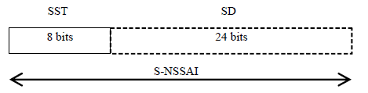
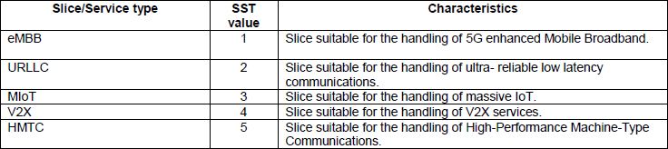

# Overview of the basic deployment

The `basic` deployment is prepared to work with internal gNBs (and UEs), only exposing the MongoDB database using `TCP port 27017`.


The `basic/ueransim` deployment works with [UERANSIM](https://github.com/aligungr/UERANSIM) using the [gNB](https://hub.docker.com/r/fgftk/gnb-ueransim) and [UE](https://hub.docker.com/r/fgftk/ue-ueransim) images.

The following commands can be used to run the `basic/ueransim` deployment
```shell
# Run the basic deployment
docker compose -f compose-files/basic/ueransim/docker-compose.yaml --env-file=build-files/open5gs.env up -d
# Stop the basic deployment
docker compose -f compose-files/basic/ueransim/docker-compose.yaml --env-file=build-files/open5gs.env down
```


The `basic/packetrusher` deployment works with [PacketRusher](https://github.com/HewlettPackard/PacketRusher) using the [packetrusher](https://hub.docker.com/r/fgftk/packetrusher) image.

The following commands can be used to run the `basic/packetrusher` deployment
```shell
# Run the basic deployment
docker compose -f compose-files/basic/packetrusher/docker-compose.yaml --env-file=build-files/open5gs.env up -d
# Stop the basic deployment
docker compose -f compose-files/basic/packetrusher/docker-compose.yaml --env-file=build-files/open5gs.env down
```

Check the [How to use the UERANSIM container](ueransim.md) and [How to use the PacketRusher container](packetrusher.md) to see how to use the emulated UEs.

# Overview of the network slicing deployment


The `network-slicing` deployment is prepared to work with internal gNBs (and UEs), only exposing the MongoDB database using `TCP port 27017`.

This example is based on [s5uishida snssai upf sample](https://github.com/s5uishida/open5gs_5gc_ueransim_snssai_upf_sample_config).

The `network-slicing` deployment works with UERANSIM using the gNB and UE images.

This deployment connects two UERANSIM UEs (UE1 and UE2) to a UERANSIM gNB. The UEs are configured to select two different network slices, both present on the Open5GS 5G Core configuration files.

### UE1 configuration:
```yaml
dnn: internet
sst: 1
sd: 000001
```

### UE2 configuration:
```yaml
dnn: internet
sst: 1
sd: 000002
```

When this configuration is received in the 5G Core, the AMF uses it to select the appropiate SMF.

SMF1 is configured to serve the `sst: 1` and `sd: 000001`.

SMF1 is connected to UPF1, serving IP addresses at the DNN `internet` from the pool `10.45.0.0/24`.

SMF2 is configured to serve the `sst: 1` and `sd: 000002`.

SMF2 is connected to UPF2, serving IP addresses at the DNN `internet` from the pool `10.46.0.0/24`.

## Succesful operation

When testing this, *after adding the UEs to the database with the appropiate values*, `UE1` should receive IP address `10.45.0.2` and `UE2` should receive IP address `10.46.0.2`.

The following commands can be used to run the `network-slicing` deployment
```shell
# Run the basic deployment
docker compose -f compose-files/network-slicing/docker-compose.yaml --env-file=build-files/open5gs.env up -d
# Stop the basic deployment
docker compose -f compose-files/network-slicing/docker-compose.yaml --env-file=build-files/open5gs.env down
```

### Further information on identification of Network Slice

The identification of a Network Slice is indicated by a NAS Information Element called S-NSSAI (Single Network Slice Selection Assistance Information) as structured as below. S-NSSAI is made up of two field SST (Slice/Service Type) and SD (Service Differentiator). SD is an optional field. SST has 8 bit field length implying that it can indicates a total of 255 different slice types. 
The SST field may have standardized and non-standardized values. Values 0 to 127 belong to the standardized SST range. Values 128 to 255 belong to the Operator-specific range.

NOTE: 23.003-28.4.2 states 'The SD field has a reserved value "no SD value associated with the SST" defined as hexadecimal FFFFFF. In certain protocols, the SD field is not included to indicate that no SD value is associated with the SST'.

< 23.003 - Figure 28.4.2-1: Structure of S-NSSAI >



- SST indicates Slice Service Type which is a mandatory item.
- SD indicates a kind of slice ID within the SST which is an option item. This is used to indicates a specific slices in case where there are one or more slices are supported in the same SST.

The SST standardized in 3GPP as of now are as shown. Only 5 (as of  23.501 version 17.5.0) out of 127 possible types that can be configured by SST field.

< 23.501 v17.5 - Table 5.15.2.2-1 - Standardised SST values >



# Overview of the roaming deployment

The `roaming` deployment is prepared to work with Open5GS Local Breakout (LBO) Roaming feature and PacketRusher (gNB and UE), only exposing the MongoDB database using `TCP port 27017`.

Two 5G Cores are deployed for this example, one for the visited network (with PLMN 999 70) and one for the home network (with PLMN 001 01).

This example only deploys the minimum number of Network Functions in order to test the setup. One database is used, for the home network user authentication. So, in this case, the UE with IMSI 001011234567891 must be present on the database. The Roaming agreement is present on the visited network PCF (v-pcf) configuration file, under the `policy` section. That is because the visited network does not have any information for the user apart from that.

The communication between the two 5G Cores is done via the SEPP Network Functions.


Even though, the two SBI sections are separated in the diagram, only one docker network is created so in reality everything is interconnected. This is shown this way for a better understanding.

The following commands can be used to run the `roaming` deployment
```shell
# Run the basic deployment
docker compose -f compose-files/roaming/docker-compose.yaml --env-file=build-files/open5gs.env up -d
# Stop the basic deployment
docker compose -f compose-files/roaming/docker-compose.yaml --env-file=build-files/open5gs.env down
```

# Overview of the scp deployment


The `scp` deployment is prepared to work with internal gNBs (and UEs), only exposing the MongoDB database using `TCP port 27017`.

This deployment comes with two variants the `Model C` and the `Model D`.

The `Model D` or `indirect communication with delegated discovery`, makes all the Network Functions present in the 5G Core to perform the requests to the SCP and the SCP (acting like a proxy) forwards the request to the appropiate Network Function. In `Model D` this includes the Network Function discovery mechanisms, so the SCP will receive the discovery request and forward it to the NRF.


The following commands can be used to run the `scp/model-c` deployment
```shell
# Run the basic deployment
docker compose -f compose-files/scp/model-d/docker-compose.yaml --env-file=build-files/open5gs.env up -d
# Stop the basic deployment
docker compose -f compose-files/scp/model-d/docker-compose.yaml --env-file=build-files/open5gs.env down
```

The `Model C` or `indirect communication`, makes all the Network Functions present in the 5G Core to perform the requests to the SCP and the SCP (acting like a proxy) forwards the request to the appropiate Network Function. But `Model C` still uses direct communication with the NRF for the Network Function discovery mechanisms.


The following commands can be used to run the `scp/model-c` deployment
```shell
# Run the basic deployment
docker compose -f compose-files/scp/model-c/docker-compose.yaml --env-file=build-files/open5gs.env up -d
# Stop the basic deployment
docker compose -f compose-files/scp/model-c/docker-compose.yaml --env-file=build-files/open5gs.env down
```

More information can be read in this [Ericsson White Paper about indirect communication](https://www.ericsson.com/en/reports-and-papers/white-papers/indirect-communication-for-service-based-architecture-in-5g-core).

# Overview of the speed-test deployment


The `speed-test` deployment works with [PacketRusher](https://github.com/HewlettPackard/PacketRusher).

This deployment connects an emulated UE and gNB to the Open5GS 5G Core.

It has an iPerf server connected using the Docker image `mlabbe/iperf3:latest`. This iPerf server is reachable from all the containers connected to the `open5gs` network in the Docker Compose deployment using the domain name `test.iperf.org`.

To perform a basic test, first check that all the containers in this deployment are running properly with:
```bash
docker ps -a
```

After checking the PacketRusher container and all the other containers are running, execute the following command to start an interactive session inside the PacketRusher container:
```bash
docker exec -it packetrusher bash
```

If the PacketRusher container is not up, check the [common issues with the PacketRusher container](#common-issues-with-the-packetrusher-container) section.

In this example, only one gNB and one UE are being emulated. PacketRusher lets you use the UE connection by executing commands inside the VRF created by the emulated gNB. If you check the logs after a successful deployment, you will see something like this:
```cmd
...
time="your-date" level=info msg="[UE][NAS] Receiving PDU Session Establishment Accept"
time="your-date" level=info msg="[UE][NAS] PDU session QoS RULES: [1 0 6 49 49 1 1 255 1]"
time="your-date" level=info msg="[UE][NAS] PDU session DNN: internet"
time="your-date" level=info msg="[UE][NAS] PDU session NSSAI -- sst: 1 sd: 001"
time="your-date" level=info msg="[UE][NAS] PDU address received: 10.45.0.2"
time="your-date" level=info msg="[GNB] Initiating PDU Session Resource Setup Response"
time="your-date" level=info msg="[UE][GTP] Interface val1234567891 has successfully been configured for UE 10.45.0.2"
time="your-date" level=info msg="[UE][GTP] You can do traffic for this UE using VRF vrf1234567891, eg:"
time="your-date" level=info msg="[UE][GTP] sudo ip vrf exec vrf1234567891 iperf3 -c IPERF_SERVER -p PORT -t 9000"
...
```

The important part is the last part:
```cmd
"[UE][GTP] You can do traffic for this UE using VRF vrf1234567891, eg:"
"[UE][GTP] sudo ip vrf exec vrf1234567891 iperf3 -c IPERF_SERVER -p PORT -t 9000"
```

In this example, you can connect to the VRF by executing the following command inside the PacketRusher container:
```bash
ip vrf exec vrf1234567891 bash
```

The numbers on the VRF are the MSIN value specified on the config file located at `configs/speed-test/packetrusher.yaml`.

You can perform an iPerf test inside the VRF to check the UE connection:
```bash
# inside the VRF of the PacketRusher container
iperf3 -c <IPERF_SERVER_IP_ADDRESS> -t 9000
```

The VRF does not resolve the domain names provided by Docker Compose. To retrieve the IP address of the `test.iperf.org` domain name, execute inside the PacketRusher container (outside of the VRF):
```bash
# inside the PacketRusher container
dig +short test.iperf.org
```

This will provide the IP address of the iperf container, after that specify it on the `<IPERF_SERVER_IP_ADDRESS>`.

It is a bit difficult to differentiate if you are executing things inside the VRF or on the PacketRusher container. A way to differentiate it after performing a test is that the bitrate difference between executing the iperf test inside the container and inside the VRF should be pretty significant.

In my specific deployment, executing the test inside the PacketRusher container gives a bitrate around 22 Gbit/s and executing it inside the VRF gives a bitrate around 450 Mbit/s.

## Common issues with the PacketRusher container

### Issue 1: PacketRusher container version VS PacketRusher host version
Some issues appear due to not having the same version of PacketRusher being installed on the host machine (free5gc's gtp5g kernel module) and the PacketRusher version being compiled for the Docker image. The current image uses the PacketRusher tag `20240521`, so make sure to checkout to this version for the PacketRusher being installed on the host machine.

### Issue 2: Cannot allocate memory
Sometimes this error appears:
```cmd
time="your-date" level=info msg="[GNB][GTP] Unable to create Kernel GTP interface: cannot allocate memory1234567891val1234567891"
```

I do not know why this error happens, restarting the Docker Compose deployment fixes the issue.

The following commands can be used to run the `speed-test` deployment
```shell
# Run the basic deployment
docker compose -f compose-files/speed-test/docker-compose.yaml --env-file=build-files/open5gs.env up -d
# Stop the basic deployment
docker compose -f compose-files/speed-test/docker-compose.yaml --env-file=build-files/open5gs.env down
```